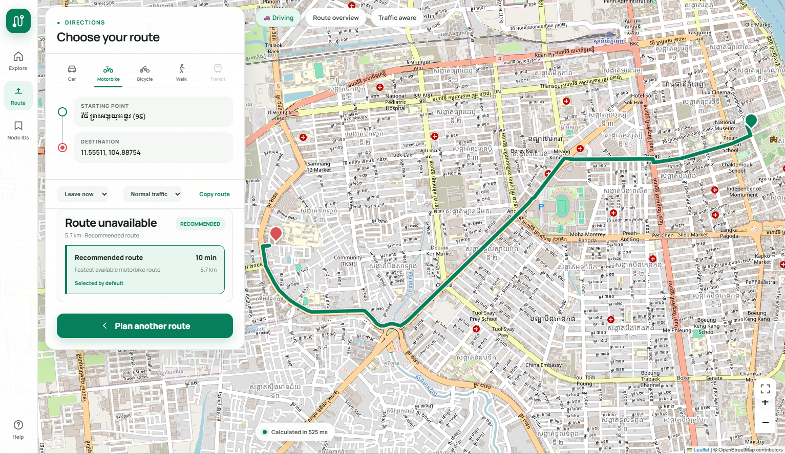

# SmartRoutePP

SmartRoutePP is a FastAPI map and routing application for Phnom Penh. It supports
location search, map pins, multiple destinations, travel modes, recommended routes,
Google Maps link imports, and custom map updates.



## Install

Requires Python 3.11 or newer.

```bash
python -m venv .venv
source .venv/bin/activate       # Windows: .venv\Scripts\activate
python -m pip install -r requirements.txt
cp .env.example .env           # Windows: copy .env.example .env
python -m tortoise -c services.settings.TORTOISE_ORM migrate
python main.py
```

Open <http://127.0.0.1:8000>. API documentation is available at
<http://127.0.0.1:8000/docs>.

## Configuration

Edit `.env` when you need different database, map, or server settings:

```dotenv
DB_CONNECTION=sqlite
DB_DATABASE=maps/maps.db
SMARTROUTE_MAP_REGION=cambodia/phnom_penh
APP_HOST=127.0.0.1
APP_PORT=8000
APP_RELOAD=false
```

For MySQL, set `DB_CONNECTION=mysql` and configure `DB_HOST`, `DB_PORT`,
`DB_DATABASE`, `DB_USERNAME`, and `DB_PASSWORD`.

## Usage

1. Search for a place, paste a Google Maps link, or pin a point on the map.
2. Set the destination and add optional stops.
3. Select a travel mode and choose **Show route**.

The recommended route is shown first. Places and route endpoints use readable
location names rather than internal node IDs.

## Map data

Base maps and overlays are organized by region:

```text
maps/<country>/<province>/base/
maps/<country>/<province>/overlays/
```

GraphML stores the base road network. The database stores smaller updates such as
places, custom routes, closures, revisions, and images.

## Development

```bash
# Apply database migrations
python -m tortoise -c services.settings.TORTOISE_ORM migrate

# Run tests
python -m pip install pytest
python -m pytest -q
```
